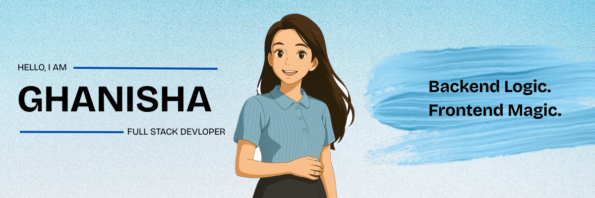

  

# 💫 About Me:
💻 Full-stack development enthusiast focused on building scalable web applications 🎯 Hands-on exposure to backend database design and frontend UI development 🔥 Strong believer in clean code and following best development practices 🚀 Focused on improving performance and efficiency in web applications 🎨 Think beyond code to how features function in real-world scenarios 📚 Continuous learner actively enhancing skills through hands-on development and practice 💡 Problem solver at heart, love turning complex challenges into simple solutions ⚡ Comfortable working in collaborative environments where ideas flow and code reviews are constructive 🤝 Open to collabs / internships 

## 🌐 Socials:

  
  
  

## 🛠️ Tech I use

  

---

  

 

# 📊 GitHub Stats:
 
 

---

